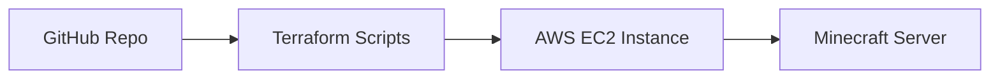

# Acme Corp Minecraft Server Setup

Welcome to the Acme Corp Minecraft Server setup guide! This repository contains scripts and instructions to fully automate the provisioning, configuration, and setup of a Minecraft server on AWS.

## Background

In this project, we will:
- Provision AWS resources using Terraform.
- Configure and set up a Minecraft server on an EC2 instance using a shell script (`setup.sh`).
- Ensure the server auto-starts and shuts down properly.

## Requirements

To run this pipeline, you will need:
- **AWS Account**: Credentials configured via AWS CLI.
- **AWS CLI**: Version 2.0+ [Install AWS CLI](https://docs.aws.amazon.com/cli/latest/userguide/install-cliv2.html)
- **Terraform**: Version 1.0+ [Install Terraform](https://learn.hashicorp.com/tutorials/terraform/install-cli)
- **nmap**: Version 7.80+ [Install nmap](https://nmap.org/book/inst-windows.html)
- **SSH Key Pair**: Generate an SSH key pair to access your EC2 instance.

### Configuration and Environment Variables

- **AWS Credentials**: Ensure your AWS CLI is configured with your credentials.
- **SSH Key Pair**: Make sure you have an SSH key pair generated and the public key available.

## Setup Diagram



## Steps

### 1. Clone the Repository

```sh
git clone https://github.com/blakeschafer/Minecraft-Server.git
cd Minecraft-Server
```

### 2. Generate and Configure SSH Key Pair

1. **Generate SSH Key Pair**:

    ```sh
    ssh-keygen -t rsa -b 2048 -f ~/.ssh/your-key
    ```

    This command generates two files:
    - `~/.ssh/your-key`: The private key (keep this secure).
    - `~/.ssh/your-key.pub`: The public key.

2. **Configure AWS CLI**:

    Ensure your AWS CLI is configured with the necessary credentials. Follow these steps:

    ```sh
    aws configure
    ```

    Enter your AWS credentials and region when prompted:

    ```plaintext
    AWS Access Key ID [None]: YOUR_ACCESS_KEY
    AWS Secret Access Key [None]: YOUR_SECRET_KEY
    Default region name [None]: us-west-2
    Default output format [None]: json
    ```

3. **Verify Configuration**:

    ```sh
    aws sts get-caller-identity
    ```

   This command should return your AWS account details if the configuration is correct.

### 3. Provision Infrastructure with Terraform

Navigate to the `terraform` directory and apply the configuration.

```sh
cd terraform
terraform init
terraform apply
```

### 4. Configure the Minecraft Server

Terraform will automatically run the `setup.sh` script on the EC2 instance after provisioning it.

### 5. Connect to the Minecraft Server

Find the public IP address of your EC2 instance from the Terraform output and connect to the Minecraft server.

#### Using `nmap`:

```sh
nmap -sV -Pn -p T:25565 <instance_public_ip>
```

#### Using Minecraft Client:

1. Open Minecraft.
2. Go to Multiplayer.
3. Add a new server with the public IP address of your EC2 instance printed by terraform.
4. Connect to the server.

## File Descriptions

### Terraform

- **main.tf**: Defines the AWS infrastructure resources, including the EC2 instance and security group.
- **variables.tf**: Contains configurable parameters for your Terraform scripts.
- **outputs.tf**: Specifies output values, such as the public IP address of the EC2 instance.

### Shell Script

- **setup.sh**: Shell script for the initial setup and configuration of the Minecraft server on the EC2 instance. It installs necessary packages, downloads the Minecraft server, and sets up a systemd service to manage the Minecraft server process.

```sh
#!/bin/bash

# Update package sources
sudo apt-get update -y

# Install Java
sudo apt-get install -y openjdk-11-jre-headless

# Create a user for Minecraft
sudo useradd -m -r -d /opt/minecraft minecraft

# Download Minecraft server
sudo wget -O /opt/minecraft/server.jar https://launcher.mojang.com/v1/objects/e3a2fbdc18c27b14b8b4b55b1e2b8d1bdcd85c87/server.jar

# Create a systemd service for Minecraft
sudo bash -c 'cat << EOF > /etc/systemd/system/minecraft.service
[Unit]
Description=Minecraft Server
After=network.target

[Service]
User=minecraft
WorkingDirectory=/opt/minecraft
ExecStart=/usr/bin/java -Xmx1024M -Xms1024M -jar server.jar nogui
Restart=on-failure

[Install]
WantedBy=multi-user.target
EOF'

# Enable and start the Minecraft service
sudo systemctl enable minecraft
sudo systemctl start minecraft
```

## Resources and Sources

- [AWS CLI Documentation](https://docs.aws.amazon.com/cli/latest/userguide/cli-configure-quickstart.html)
- [Terraform Documentation](https://www.terraform.io/docs)
- [Minecraft Server Setup](https://minecraft.gamepedia.com/Tutorials/Setting_up_a_server)
